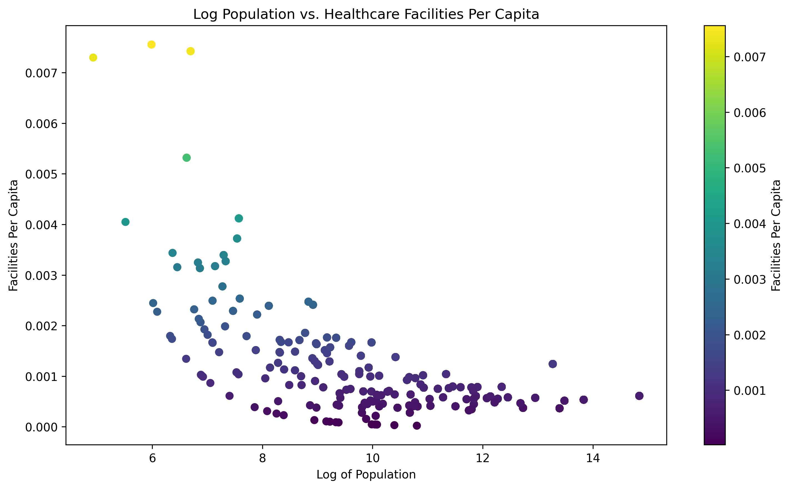
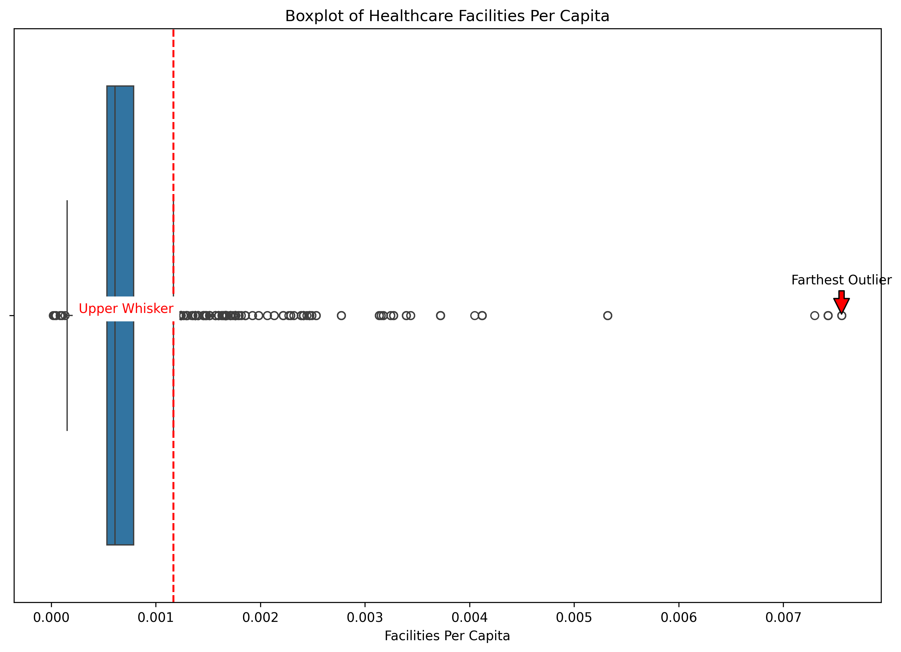
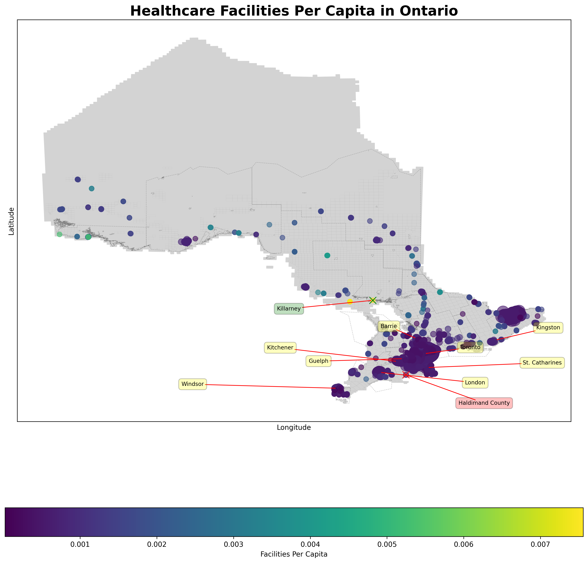

# Healthcare Accessibility Across Ontario

## Project Overview
This project aims to analyze healthcare accessibility across different regions in Ontario by visualizing the distribution and density of healthcare facilities in relation to the population. This allows us to identify areas with potentially insufficient healthcare services.

## Data Sources
- **Hospital Locations**: Extracted from Ontario's open data portal. This dataset includes information on the names, types, and locations of healthcare facilities in Ontario.
  - Data URL: [Ontario Hospital Locations](https://data.ontario.ca/dataset/hospital-locations)
- **Population Data**: Provides population statistics for municipalities in Ontario, essential for per capita calculations.
  - Data URL: [Ontario Population and Dwelling Counts](https://www150.statcan.gc.ca/t1/tbl1/en/tv.action?pid=9810000202)

## Data Processing

The data is cleaned and merged to create a comprehensive dataset that includes the number of facilities per capita for each community. The cleaning process involves converting textual numeric values to actual numbers and dealing with any missing or duplicate data.

## Visualizations

Several visualizations are generated as part of the analysis:

### Bar Chart of Facilities Per Capita

*This bar chart displays the number of healthcare facilities relative to the population size for each community, sorted to show communities with the highest and lowest facilities per capita.*

### Scatter Plot of Population vs. Facilities Per Capita

*Illustrates the relationship between population size and the number of facilities per capita.*

### Boxplot of Healthcare Facilities Per Capita

*Provides a statistical summary of the facilities per capita data, highlighting the distribution and identifying any outliers.*

### Choropleth Map of Facilities Per Capita

*A geographical map showing the distribution of facilities per capita across Ontario, with annotations for significant regions.*


## Functions Description

- `load_population_data()`: Loads and cleans population data from a CSV file.
- `clean_population_data()`: Removes unnecessary commas from numeric values and handles non-numeric data.
- `load_hospital_data()`: Loads and cleans hospital location data from a CSV file.
- `clean_hospital_data()`: Processes hospital data to remove duplicates and unnecessary information.
- `merge_datasets()`: Merges population and hospital data on the community name.
- `plot_bar_chart_of_facilities_per_capita()`: Generates and saves a sorted bar chart of facilities per capita.
- `fetch_geopy_coordinates()`: (Optional) Fetches geographical coordinates for each hospital location. This is typically pre-processed due to long run times.
- `load_precollected_data()`: Loads previously fetched geographical coordinates.
- `load_geonames_data()`: Loads geographical names data for Ontario.
- `normalize_marker_sizes()`: Normalizes marker sizes for the choropleth map.
- `plot_ontario_map()`: Creates a choropleth map with normalized marker sizes.
- `identify_extreme_cities()`: Identifies the communities with the highest and lowest facilities per capita.
- `plot_population_vs_facilities()`: Generates and saves a scatter plot of population vs. facilities per capita.
- `plot_facilities_boxplot()`: Generates and saves a boxplot of facilities per capita.
- `plot_scatter_trend()`: Generates and saves a scatter plot with a trend line showing the relationship between population size and facilities per capita.

## Requirements

This project requires Python and the following libraries:
- pandas
- geopandas
- matplotlib
- seaborn
- shapely
- geopy
- tqdm
- adjustText

## Installation and How to Run

Clone this repository or download the files into your local machine. To install the required Python libraries and run the main.py script, run:
```bash
pip install -r requirements.txt 
python main.py


